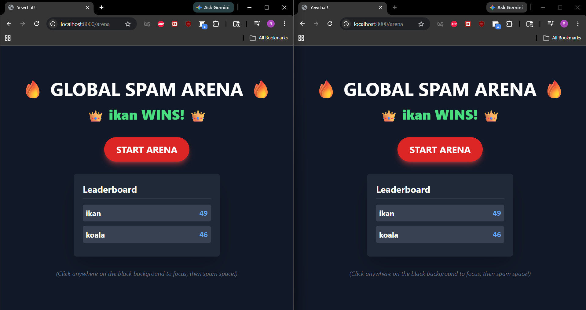

## Experiment 3.1

## Experiment 3.2

Konsep Modifikasi:
Sebagai bentuk kreativitas pada antarmuka client, saya menambahkan sebuah fitur mini-game interaktif berkonsep "Global Spam Arena". Aplikasi ini kini memiliki rute navigasi baru (/arena) yang dapat diakses langsung dari halaman login tanpa menghilangkan fitur chat aslinya.

Konsep permainannya memanfaatkan sifat asli dari server SimpleWebsocketServer (Node.js) yang mem-broadcast semua pesan ke seluruh klien. Semua pemain yang masuk ke halaman /arena berada di satu "ring" yang sama. Pemain berlomba memencet Spacebar secepat mungkin, dan pemain pertama yang mencapai skor 50 akan memicu pesan pengumuman pemenang di layar semua klien secara real-time.

Alur Kerja & Arsitektur Kode:

Routing: Menambahkan rute Route::Arena di dalam src/lib.rs dan tombol navigasinya di src/components/login.rs.

State Management & Sinkronisasi: Seluruh logika game berada di src/components/arena.rs. Saat tombol "START ARENA" ditekan, klien mengirimkan payload arena_action: "start". Server mem-broadcast pesan tersebut, sehingga skor semua pemain ter-reset secara serentak dan game state berubah menjadi aktif.

Event Listener: Menggunakan event onkeydown bawaan Yew untuk menangkap input Spacebar. Setiap tekanan akan meng-increment skor lokal dan mengirimkan payload arena_action: "update" agar leaderboard di layar pemain lain ikut diperbarui.

Data Parsing: Agar pesan tidak tercampur dengan Chat biasa, pesan arena menggunakan struct khusus ArenaMessage.